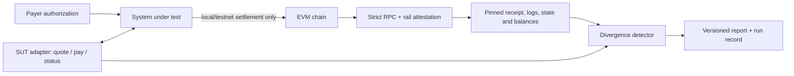

# Architecture

psv verifies a complete payment system, not one HTTP response. The SUT adapter
captures what the system believes; the chain oracle independently proves what
happened. The divergence detector compares those two records.

## Trust boundaries

SUT responses and RPC responses are untrusted. Wire booleans, hashes, addresses,
CAIP-2 networks, numeric domains, JSON-RPC envelopes and result shapes are parsed
strictly and fail closed. No verdict is produced from a malformed or ambiguous
response.

The bundled reference SUT has one value-bearing boundary. Before calldata,
transaction construction, signing or broadcast, `psv.safety` verifies:

- the configured chain is in the immutable local/testnet allowlist;
- live `eth_chainId` equals the configured chain;
- token, payer and payee are exact nonzero addresses;
- deployed token code exists; and
- the authorization amount equals the positive quoted amount.

Mainnets and unknown chains have no runtime override.

## Atomic chain evidence

`reconcile_live` accepts an exact transaction hash, Transfer log index and required
amount. It then binds all evidence to one rail and observation window:

1. Verify the RPC chain and rail attestation.
2. Select the rail's `safe`, `finalized` or explicit finality block.
3. Fetch one receipt and require its transaction hash, status and canonical block.
4. Decode one exact token/from/to/value Transfer log plus one matching
   `AuthorizationUsed(authorizer, nonce)` log.
5. Read code, nonce state and payer/payee balances at pinned parent/settlement
   blocks.
6. Reject same-block transfer races, removed/duplicate/malformed logs and
   unattributable balance changes.
7. Re-fetch receipt/block identity to detect a reorg during observation.
8. Grade SUT belief only from that evidence bundle.

Aggregate `latest` balance deltas cannot establish a positive settlement verdict.

## Modules

| Module | Responsibility |
|---|---|
| `psv.anvil` | Strict JSON-RPC 2.0 client and local Anvil lifecycle/control. |
| `psv.chain` | Exact ABI, block-pinned token reads and settlement-state types. |
| `psv.payloads` | EIP-3009/EIP-712 authorization construction for local/test chains. |
| `psv.safety` | Central fail-closed pre-signing policy for the reference SUT. |
| `psv.sut` | Strict adapter contract and bounded, closeable HTTP implementation. |
| `psv.reference_sut` | Calibration SUT with intentionally selectable damage behaviors. |
| `psv.rails` | Versioned rail identity, runtime drift attestation and finality. |
| `psv.reconciliation` | Exact settlement identities and ledger/chain credit diff. |
| `psv.divergence` | Consistent, silent-loss, phantom-credit and underpaid verdicts. |
| `psv.report` | Reconciliation report v2, provenance, reason codes and privacy policy. |
| `psv.run_record` | Run-record v1.1 integrity checksum and concurrency-safe journal. |
| `psv.load` | Staged load profiles, facilitator pooling and JSON metrics. |

## SUT adapter contract

- `POST /quote` returns order ID, amount, payee, asset, CAIP-2 network, domain and
  expiry.
- `POST /pay` accepts an order-bound authorization and returns exact order ID,
  settlement flag and transaction hash.
- `GET /status/{quoted-order-id}` returns exact order ID, paid flag, resource and
  transaction hash.

The adapter rejects permissive truthiness, mismatched order IDs, duplicate JSON
keys, oversized bodies and unsafe status paths. `HttpSutAdapter` owns and closes
its connection client and supports a context-manager lifecycle.

## Reproducibility and contracts

On-chain tests isolate state with Anvil snapshots/reverts and a deterministic
deployment. Offline tests inject hostile transports and synthetic receipts.

`psv` emits a v2 reconciliation report and v1.1 run record. Their checked-in JSON
Schemas and migration notes are package data. Run checksums detect accidental
modification but do not authenticate an attacker-controlled file; authenticity
requires an external signature or trust anchor.

The public support boundary is machine-readable in `support-matrix.json`. CI
rejects duplicate scenario IDs and missing registered pytest selectors.
